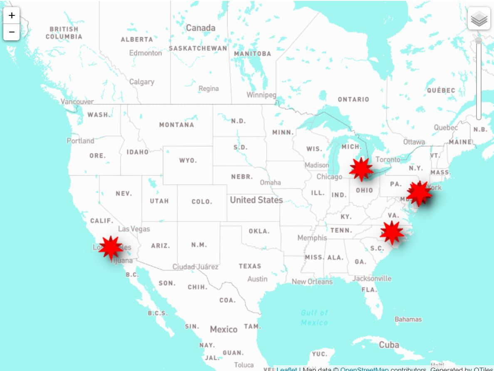

# LeafletMap

<h1>Coronavirus Twitter Talk (Leaflet)</h1>

Here is the interactive Version
<a href="file:///C:/Users/zhena/LeafletMap/covid19/index.html">Visit our HTML tutorial</a>

This visual map was created using the twitter APi crawler we used in the previous labs. I wanted to see the amount of Coronavirus tweets as the pandemic seems to get better.

The geographic region that I decided to choose was United States. Since United States has the highest numbers of cases for death and infection it was interesting to see how twitter was doing versus when this pandemic started.

The zoom levels I selected on QGIS was 0 - 6. I did this because the greater the number of zoom; the more information that is put into in scale. In this case there are 6 scales of information layers. Since I do not have a lot of data and only a couple tweets that only really tell geographic locations of each tweet I decided to use 6.
